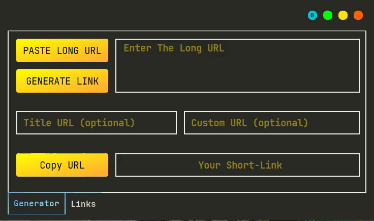

# Short_Link_Generator
A Short Link Generator created using rebrandl api and PyQt5 to make short links, just paste the link you want, I hope you like it


# Requires

```bash
  pip install PyQt5
```
```bash
  pip install urllib
```
```bash
  pip install requests
```

# Features 
- Custom URL
- Report (created links)
- csv file Export

# Usage/Examples
<kbd>
 
</kbd>


# Author
- Github: [@Aminjjjeffrey](https://github.com/Aminjjjeffrey)
- Twitter: [@Aminjjjeffrey](https://twitter.com/Aminjjjeffrey)


